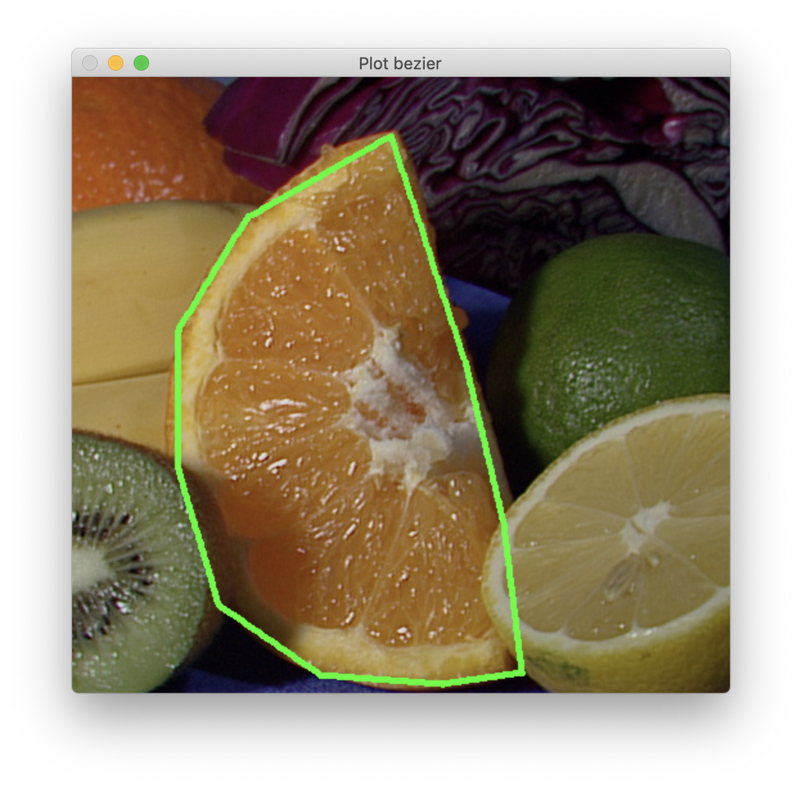
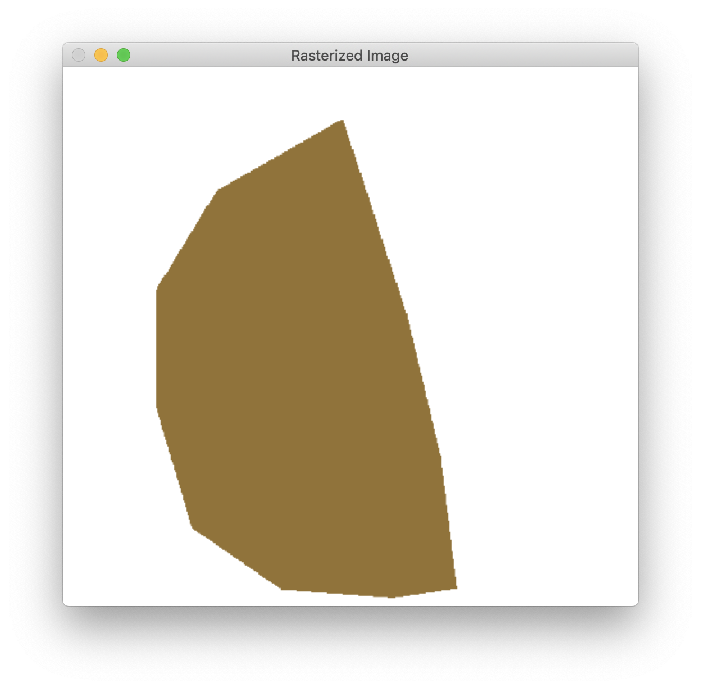

# Image_Vectorization

## Quick Start

### In a terminal:
* Once in the project run : "mkdir build && cd build/
cmake .. && make"
* Lauch the executable : ./image_vect 
* An image appears (change it in main.cpp) 
* CLICK on several points 
* END by pressing 0
* WAIT : The bezier curve will be drawn as well as the rasterized image
* 
* 

### Choose your tests
* In main.cpp comment/uncomment the tests you want to run

