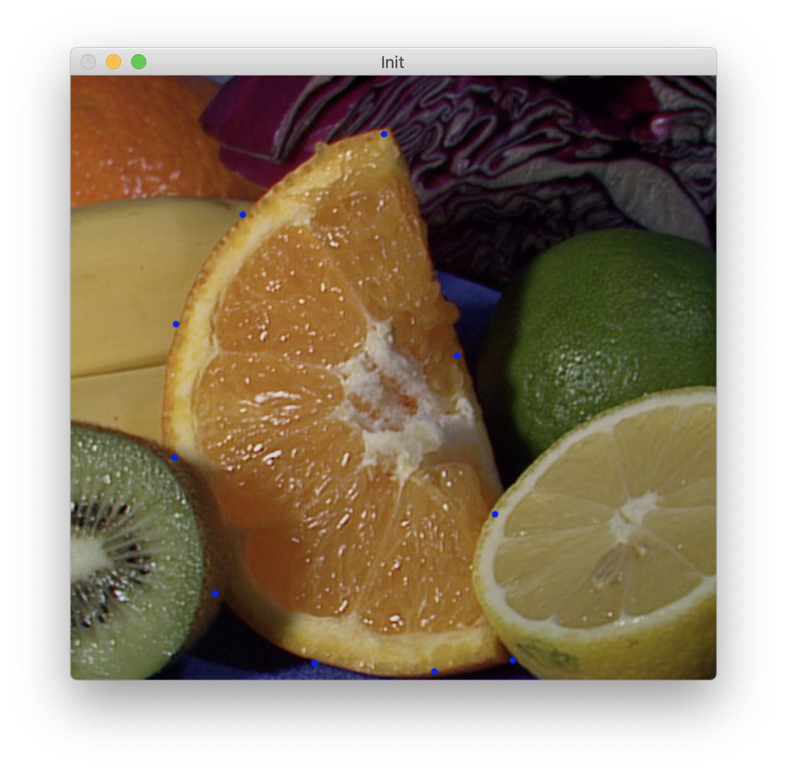

# Image Vectorization through Energy Optimization

This project implements the research paper :

*Effective Clipart Image Vectorization Through Direct Optimization of Bezigons*

## Introduction

Image vectorisation is a crucial subject for many graphic designers who often have to transform a pixelated image into a vector image. 

The implemented algorithm uses "bezigons", i.e. a closed path made up of Bezier curves, to represent the contours of vector shapes.

*Vectorization of a heart clipart*

## Steps
To do this, we proceed according to the following steps:
1. Find a first correct approximation of the image and initialise the bezigons to be optimised.
2. Optimise each of the pieces $P_j$ of bezigons $B$ according to the equation :
   
$Pj_{*}= argmin_{Pj} [E_{data}(P_j,B) +E_{prior}(P_j,B)]$.

## Quick Start

### In a terminal:
* Once in the project run : "mkdir build && cd build/
cmake .. && make"
* Lauch the executable : ./image_vect 
* An image appears (change it in main.cpp) 
* CLICK on several points 
* END by pressing 0
* WAIT : The bezier curve will be drawn as well as the rasterized image, and the results will be saved in a svg format.

